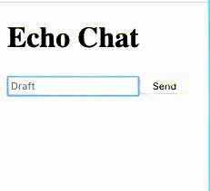

# WebSockets - [Live Demo](https://ellie-app.com/8yYgw7y7sM2a1)

This is a minimal example of how to connect to a WebSocket. It connects to `wss://echo.websocket.org` which just repeats whatever you say.



The important code lives in `src/Main.elm` and in `index.html` with comments!


## Building Locally

Run the following commands:

```bash
git clone https://github.com/elm-community/js-integration-examples.git
cd js-integration-examples/websockets

elm make src/Main.elm --output=elm.js
open index.html
```

Some terminals may not have an `open` command, in which case you should open the index.html file in your browser another way.
